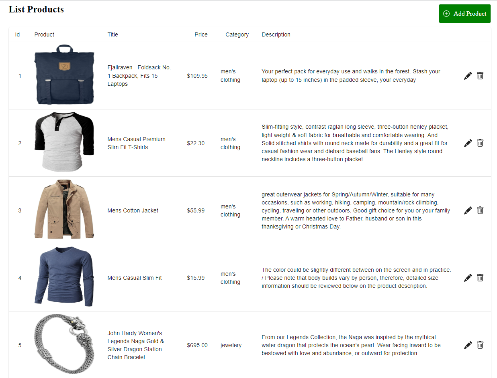

# CRUD Teste Edesoft



Este repositório foi desenvolvido como avaliação para uma vaga de emprego

## Tecnólogias

ReactJs
MaterialUI
Axios
React-Icons
React-Toastify

## API

URL: https://fakestoreapi.com/

## Instalação

Você precisará ter apenas o [NodeJS](https://nodejs.org) instalado na sua máquina, e após isso, clonar este repositório:

```sh
  $ git clone https://github.com/Bruno-Goudric/teste_edesoft.git
```

Depois disso acesse a pasta do projeto que você deseja e instale as dependências executando o seguinte comando:

```sh
  $ yarn install  ou npm install
```

## Executando a aplicação

Execute o comando a baixo para inicializar o Expo:

```sh
  $ yarn start  ou npm start
```
